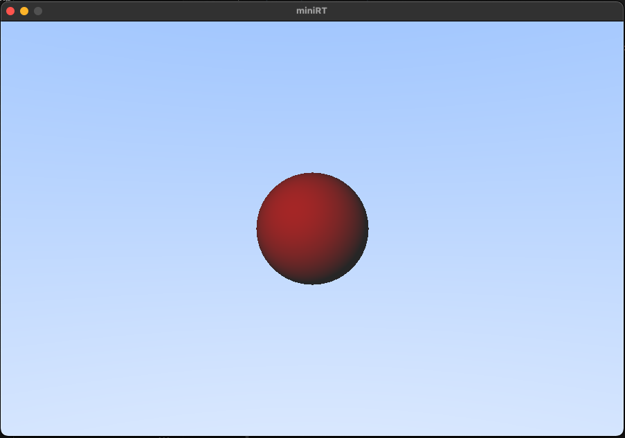
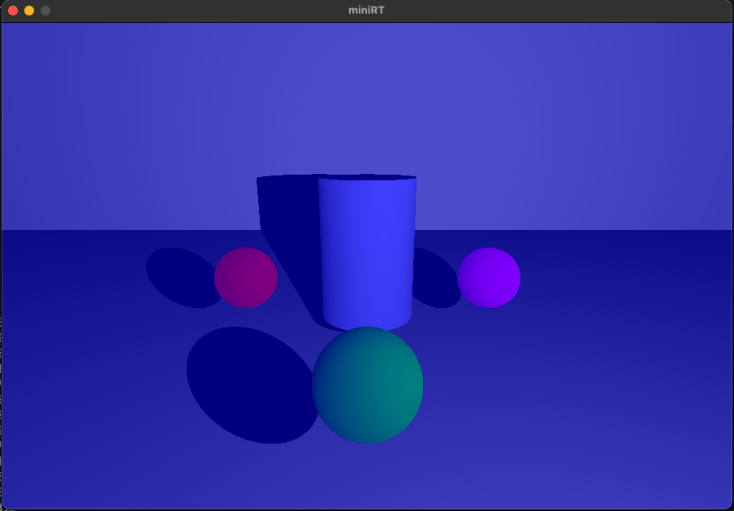

# miniRT

## What is miniRT
> This project is an introduction to the beautiful world of Raytracing. Once completed you will be able to render simple Computer-Generated-Images and you will never be afraid of implementing mathematical formulas again.

## How to run the project
```
make

./minirt <scene_file>.rt
```
## Demo
### One Sphere


### There Sphere 


### Point light


### Cylinder and Sphere


### Blue Ambient


### Sphere in the box


